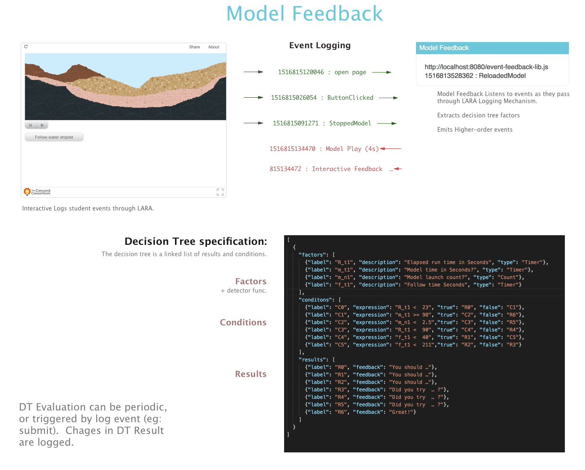
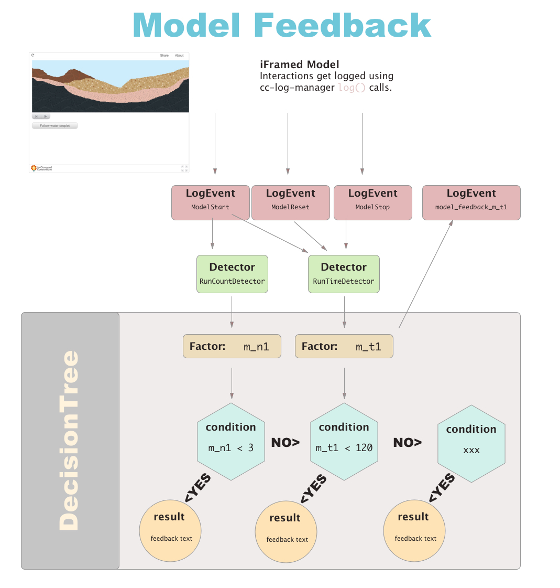

## Model Feedback

### Project Goal
Generate feedback based on user interactions from models. This repo contains Javascripts for listening to Model CC-Log-Manager Events, and providing student feedback based on how they interacted with the model.

It is intended to be used in [LARA](https://github.com/concord-consortium/lara) as  `ExternalScript`s. These scripts must be reviewed by a LARA admin before being added to the runtime. Authors must then add one more more Model Feedback script from `lara-approved-scripts/` to the interactive page.

Warning:  This is a new and experimental feature, and is subject to rapid change.

## How to work on this

These scripts are written in [TypeScript](https://www.typescriptlang.org/). They are built using [Webpack](https://webpack.js.org/) .  It is assumed that the developer has [Node](https://nodejs.org/) and [NPM](https://www.npmjs.com/) installed on the local workstation.

After cloning the repo follow these steps to get started:

1. `yarn` to install deps.
2. `webpack` to build.
2. `npm run test` to test.
3. `webpack-dev-server` to continuously build.
3. `npm run test -- --watch` to continuously run tests.

## Building:

Branches are automatically built by Travis CI and deployed to https://model-feedback.concord.org .

## Details:


The event stream is monitored and compared to a feedback decision tree. The decision tree is specified as JSON. See: https://model-feedback.concord.org/index.html for more details about the JSON format for feedback decision trees.


1. The CC-Log-Manager event stream is listened to for key events.
1. `Detectors` identify sequences of low level events, and emit new semantic events of interest.
3. `Factors` (labeled numeric values) are updated when high-level events are observed.
4. One or more `DecisionTree`s are evaluated. These trees use the state of `Factors` to evaluate  its `conditions` and determine `results`.
5. Feedback items are displayed as `results` (terminal condition nodes).


## Creating a new `ModelFeedback` script:

This is two step process:
1. Create a new Typescript class in `src/lara-approved-scripts`
2. Modify `webpack.config.js` to create a new build target for webpack.

#### Create a new TypeScript class in `src/lara-approved-scripts`
In order to be able to instrument models scripts must be added to the LARA runtime.  You can see examples of these scripts in `src/lara-approved-scripts`.  These scripts must follow a loosely defined initialization API.  The simplest example of the external script API is visible in `src/lara-approved-scripts/event-debugging.ts`

Your classes constructor should have a signature matching this:

```
  constructor(conf:any, context:Context) { … }
```
Any user-specified data from LARA (such as `DecisionTree` JSON) is passed into `conf`. `context` includes data set by the LARA Runtime system, and can safely be ignored.

After your class has been defined, you must expose it to LARA:

```
  const context:ExternalScriptHost = (window as any).ExternalScripts;
  context.register(<identifier>, <ClassName>);
```

The `identifier` is a string of your choosing, which should uniquely identify this script, and should be given to LARA administrators.

#### Modify `webpack.config.js` to create a new build target for webpack.

Look for the section named `entry: {` and add a new target label for your
script. Follow the example in the `debugging` target. The script source `<yourclass>.ts` should be the file you just added in step 1.

```
  module.exports = {
    entry: {
      …
      'debugging': ["./src/lara-approved-scripts/event-debugging.ts"],
      '<label>': ["./src/lara-approved-scripts/<yourclass>.ts"],
      …
    },
```

## Directory Specifics

* `__tests__` → Jest test files.
* `components` → React views
* `confined-model` → `WellManager`, `LayerHelper`, and Decision Tree for confined model.
* `detectors` → Event detectors
* `lara-approved-scripts` → Code entry points for Lara
* `models` → Decision Tree JSON files  (note these are just for reference, because the idea is that)
* `schemas` → You can ignore this for now. It specifies the Decision Tree JSON Schema. This was going to be used to help authors edit Decision Tree configurations. This work has been postponed.

There are other 'junk' directories that should be cleaned up eventually.  Sorry for the mess. :)

In the TOP of the source tree there are several interesting files too:
* `types.ts` defines some useful types, including named `LogEvent` `EVENT_TYPES`.
* `factor.ts`, `result.ts`, `condition.ts`, and `decision-tree.ts` all define
  parts of the `DecisionTree` outlined in the block-diagram (illustrated above).
